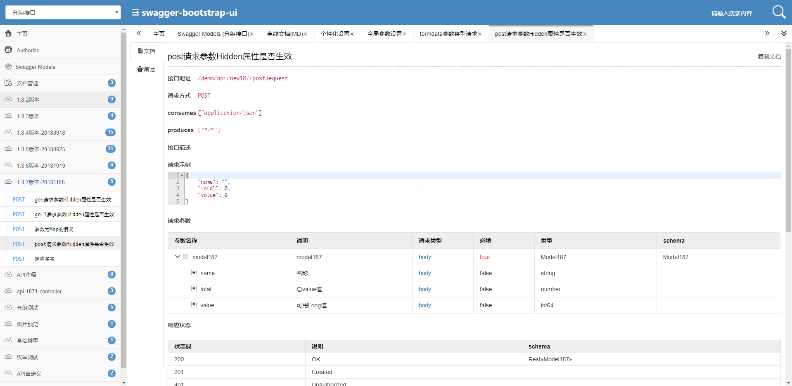
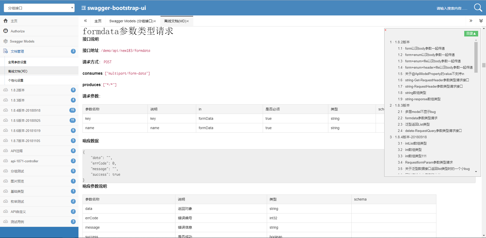

swagger-bootstrap-ui
=========================

<!-- Badges section here. -->
[](https://maven-badges.herokuapp.com/maven-central/com.github.xiaoymin/swagger-bootstrap-ui)
[](https://github.com/xiaoymin/swagger-bootstrap-ui/blob/master/LICENSE)
[](https://travis-ci.org/xiaoymin/swagger-bootstrap-ui)
[](https://github.com/xiaoymin/Swagger-Bootstrap-UI/releases)

## English introduction | [中文说明](README_zh.md)

## Introduction

`Swagger-bootstrap-UI` is the enhanced UI implementation of `springfox-swagger`, which enables Java developers to have a simple and powerful interface document experience when using Swagger

online of effect: http://swagger-bootstrap-ui.xiaominfo.com/doc.html

Project Demo:https://gitee.com/xiaoym/swagger-bootstrap-ui-demo

Document:http://doc.xiaominfo.com/

QQ communication group: 608374991

## Core

The UI enhancement package includes two core functions: **documentation** and **online debugging**

- **documentation**:According to the specification of Swagger, detailed description of interface document is listed, including interface address, type, request example, request parameter, response example, response parameter, response code and other information. By using the swagger-bootstrap UI, it can make a clear understanding of the use of this interface.
- **online debugging**:Provide a powerful online interface alignment function, the automatic analytical current interface parameters, at the same time contains a form validation, call parameters can return to the interface response content, headers, request the Curl command instances, response time, the response status code and other information, to help developers debug online, rather than through other testing tool interface is correct, introduction, powerful

## Enhancements

At the same time, while satisfying the above functions, the swagger-bootstrap UI also provides document enhancement, which is not available by the official swagger-ui. Each enhancement is applicable to the actual situation. Considering the actual development needs of developers, it is an indispensable feature, mainly including:

- **Personalized configuration**：The relevant display information of the UI can be customized through personalized UI configuration items
- **Offline files**：According to the standard specification, online markdown offline documents can be copied to generate markdown interface documents and converted to HTML or PDF through a third party markdown conversion tool
- **Interface to sort**：Since 1.8.5, UI supports interface sorting function. For example, a registration function mainly contains multiple steps. Interface sorting can be implemented according to interface sorting rules provided by swagger-bootstrap UI

## Features

- present the document in markdown form, and show the request address, type, request parameter, sample and response parameter of the document in order. The interface document is clear at a glance, which is convenient for developers to connect
- the online debugging bar, in addition to automatically parsing parameters, distinguishes colors for required items, and supports quick TAB input up and down switching. The content-type request header Type can be customized during debugging
- personalized configuration items, supporting the interface address, interface description attribute, UI enhancement and other personalized configuration functions
- interface sequencing, support for grouping and interface sorting
- support markdown documents for offline document export or online viewing of offline documents
- the global cache of debugging information still exists after page refresh, which is convenient for developers to debug
- display the Swagger Models function with a more user-friendly treetable component
- the response content can be viewed in full screen, which is convenient for debugging and copying when there are many response contents
- multiple interface documents can be displayed in TAB mode
- request parameter bar request type, color discrimination required
- the home page roughly counts the number of interfaces of different types
- support the interface online search function
- left-right menus and content pages can be freely dragged across the width
- support custom global parameter function. The home page includes header and query
- i18n international support, current support: simplified Chinese, traditional Chinese, English
- Support for jsr-303 annotations

## Directions for use

### Jar packages are introduced in Maven

Since it is an enhanced UI package for springfox-swagger, the basic functionality still depends on swagger, and the springfox-swagger jar package must be introduced

```xml
<dependency>
 <groupId>io.springfox</groupId>
 <artifactId>springfox-swagger2</artifactId>
 <version>2.9.2</version>
</dependency>
```

The jar package for the SwaggerBootstrapUi is then introduced

```xml
<dependency>
  <groupId>com.github.xiaoymin</groupId>
  <artifactId>swagger-bootstrap-ui</artifactId>
  <version>${lastVersion}</version>
</dependency>
```

### Write the Swagger2Config configuration file

The configuration file of Swagger2Config is as follows:

```java
@Configuration
@EnableSwagger2
public class SwaggerConfiguration {

 @Bean
 public Docket createRestApi() {
     return new Docket(DocumentationType.SWAGGER_2)
     .apiInfo(apiInfo())
     .select()
     .apis(RequestHandlerSelectors.basePackage("com.bycdao.cloud"))
     .paths(PathSelectors.any())
     .build();
 }

 private ApiInfo apiInfo() {
     return new ApiInfoBuilder()
     .title("swagger-bootstrap-ui RESTful APIs")
     .description("swagger-bootstrap-ui")
     .termsOfServiceUrl("http://localhost:8999/")
     .contact("developer@mail.com")
     .version("1.0")
     .build();
 }
}
```

### Access to the address 

The default access address of the swagger-bootstrap UI is: `http://${host}:${port}/doc.html`

### Attentions

Springfox-swagger defaults to two swagger interfaces that require developers to release permissions (if using the shiro permission control framework, etc.) and the enhanced interface address if using the SwaggerBootstrapUi enhancements, so there are three:


- /swagger-resources: the grouping interface for swagger

- /v2/api-docs?group=groupName :Swagger concrete grouping instance interface returns all interfaces associated with that grouping

- /v2/api-docs-ext?group =groupName: this interface is the enhanced interface address provided by the SwaggerBootstrapUi and can be ignored if no UI enhancement is used

Shiro's relevant configuration examples are as follows:

```xml
<!---other settings-->
<property name="filterChainDefinitions">    
    <value>     
        /swagger-resources = anon
        /v2/api-docs = anon
        /v2/api-docs-ext = anon
        /doc.html = anon
        /webjars/** = anon
        
        //others....
    </value>    
</property>
```

Solution to access doc.html file 404 in SpringBoot

Implement the WebMvcConfigurer interface of SpringBoot, and add the related ResourceHandler as follows:

```java
@SpringBootApplication
@ConditionalOnClass(SpringfoxWebMvcConfiguration.class)
public class SwaggerBootstrapUiDemoApplication  implements WebMvcConfigurer{

	@Override
	public void addResourceHandlers(ResourceHandlerRegistry registry) {
		registry.addResourceHandler("doc.html").addResourceLocations("classpath:/META-INF/resources/");
		registry.addResourceHandler("/webjars/**").addResourceLocations("classpath:/META-INF/resources/webjars/");
	}
}
```

Friends who use SpringMvc, which has DispatcherServlet configured in web.xml, need to append a url matching rule as follows

```xml
<servlet>
   <servlet-name>cmsMvc</servlet-name>
   <servlet-class>org.springframework.web.servlet.DispatcherServlet</servlet-class>
   <init-param>
   <param-name>contextConfigLocation</param-name>
   <param-value>classpath:config/spring.xml</param-value>
   </init-param>
   <load-on-startup>1</load-on-startup>
</servlet>
<servlet-mapping>
	<servlet-name>cmsMvc</servlet-name>
 	<url-pattern>*.htm</url-pattern>
</servlet-mapping>
<servlet-mapping>
   <servlet-name>cmsMvc</servlet-name>
   <url-pattern>/v2/api-docs</url-pattern>
</servlet-mapping>
<servlet-mapping>
   <servlet-name>cmsMvc</servlet-name>
   <url-pattern>/swagger-resources</url-pattern>
</servlet-mapping>
<servlet-mapping>
   <servlet-name>cmsMvc</servlet-name>
   <url-pattern>/v2/api-docs-ext</url-pattern>
</servlet-mapping>
```

## Figures







## Donation

No matter how much you donate, it will be enough to express your wishes. Thank you very much!!! Thank you ~ ~ ~ :)

<figure class="half">
    
    
</figure>

